# Classifying International Football Matchup Archetypes: A Longitudinal Analysis of FIFA World Cup Outcomes (1930–2026)

**sophia**
*Proposal for Thesis / Milestone Project*
*June 2026*

**Author background.** Machine learning and data science coursework including supervised learning, unsupervised learning, deep learning, and feature engineering. Prior project experience in data pipeline architecture, web scraping at scale, and dimensional modeling across academic and industry contexts. This project integrates all of these competencies into a single end-to-end system: automated data collection via GitHub Actions cron jobs, dimensional modeling of 49K+ matches, archetype discovery, supervised prediction, and live validation against the 2026 tournament.

**Repository:** [github.com/sboettch/fifaworldcup2026](https://github.com/sboettch/fifaworldcup2026)

> **Key figures:** 49,493 international matches (1872–2026) · 1,290 player entries across 48 squads · 342 canonical teams · 23 World Cup editions · 8 proposed archetype labels · 2026 live data snapshots continuing through July 19, 2026.

---

## Abstract

> **In one sentence:** We introduce *matchup archetypes* — a multi-label taxonomy of structural game contexts — as an intermediate representation between raw team features and match outcome prediction, and validate the framework on live 2026 World Cup results.

Predicting FIFA World Cup match outcomes remains difficult because standard approaches reduce each matchup to a scalar rating comparison, obscuring the structural context — whether a game is a clash of two defensive powerhouses, a host nation under pressure, or a squad in generational transition. This project proposes **matchup archetypes** as an intermediate representation: a multi-label taxonomy of recurring matchup contexts (e.g., *heavyweight clash*, *host pressure game*, *generational transition*) constructed from pre-match features spanning squad composition, Elo ratings, and tournament context. We combine four source layers — a relational World Cup backbone (1930–2026), squad-level enrichment with player demographics, pre-match Elo ratings rebuilt from 49,493 international matches, and modern event-level data — into a unified analytical dataset. We train four primary supervised model families — logistic regression, random forest, gradient boosting, and multilayer perceptron — and five unsupervised clustering methods to discover and validate archetype structure. The 2026 tournament layer is used for live data ingestion and validation; prediction snapshots are explicitly marked as pre-match only when generated before the corresponding match date, while completed-match snapshots are treated as retrospective validation artifacts.

---

## 1. Introduction

### 1.1 Motivation

The FIFA World Cup is the most-watched sporting event on Earth — the 2022 final drew an estimated 1.5 billion viewers — yet its outcomes remain remarkably difficult to predict. The global sports betting market exceeded $230 billion in 2024, with football accounting for the largest share, yet the best Elo-based models explain only ~12% of World Cup match outcome variance (Hvattum & Arntzen, 2010), leaving the vast majority of structural matchup signal untapped.

Traditional approaches rely on team-level ratings (Elo, FIFA ranking, FiveThirtyEight SPI) or player-level aggregations, but these reduce each matchup to a single scalar comparison: "Team A is rated higher than Team B." This obscures the *structural character* of the matchup — whether a game is a clash of two defensive powerhouses, a host nation under pressure against a tactically flexible underdog, or a squad in generational transition facing a deep roster of elite-club veterans. Our archetype framework directly targets the remaining signal by characterizing the *type* of matchup, not just the strength differential.

We hypothesize that matchups have **archetypes** — recurring structural patterns that transcend individual team identities — and that these archetypes carry predictive information about match outcomes (win probability, volatility, upset likelihood) beyond what scalar ratings capture.

**Methods summary.** On the unsupervised side, we apply five clustering methods (k-means, GMM, hierarchical, HDBSCAN, NMF) to discover archetype structure in the matchup feature space and compare discovered clusters against rule-based labels. On the supervised side, the main scored comparison uses four implemented model families — probabilistic (logistic regression), tree-based bagging (random forest), tree-based boosting (gradient boosting), and neural network (multilayer perceptron) — to predict match outcomes conditioned on archetype features. Experimental GA, HyperNEAT-inspired, and cellular-automaton classifiers remain in `src/models/` as extension work, but they are not included in the main comparison unless their outputs are regenerated and reported. We evaluate via leave-one-tournament-out cross-validation and 2026 validation snapshots, comparing against Elo-only and majority-class baselines through formal ablation.

### 1.2 The 2026 Opportunity

The 2026 World Cup is historically unique in three ways:

- **First 48-team tournament** (expanded from 32), with 12 groups of four and an expanded knockout bracket of 104 matches
- **Three host countries** (United States, Canada, Mexico) — unprecedented co-hosting across a continent, creating novel home-advantage dynamics
- **Live validation window**: the tournament is currently underway (group stage completed June 27, 2026; knockout stage through July 19), enabling ongoing live ingestion and pre-match prediction snapshots for future matches

This creates a rare validation scenario: we build archetype models on 1930–2022 data, classify the 2026 matchups, generate probabilistic predictions before selected matches are played, and compare against real results as the knockout stage unfolds.

### 1.3 Research Questions

1. **Can World Cup matchups be meaningfully classified into archetypes** using pre-match features such as squad composition, ratings, host context, and experience gaps?
2. **Do archetypes predict match outcomes** — win, draw, loss, upset probability, extra-time likelihood, or penalties — beyond what team ratings alone capture?
3. **Are archetypes stable across eras**, or do they shift as tournament format, squad size, and tactical norms evolve?
4. **Can archetype-based predictions generalize** to the unprecedented 2026 format of 48 teams and three host countries?

---

## 2. Related Work

### 2.1 Match Outcome Prediction in Football

Quantitative prediction of football match outcomes has a substantial literature. Maher (1982) introduced the independent Poisson model for goal scoring, later refined by Dixon and Coles (1997) to account for low-scoring dependency. These statistical models underpin most modern forecasting systems.

Rating-based approaches — particularly Elo ratings adapted from chess (Elo, 1978) — have proven remarkably effective for international football. Hvattum and Arntzen (2010) demonstrated that Elo ratings outperform FIFA rankings for World Cup prediction. Lasek et al. (2013) provided a systematic comparison of Elo variants for football, while Stefani (2011) compared rating systems across multiple sports and found Elo-family models consistently among the best for pairwise prediction. The World Football Elo Ratings system (eloratings.net) maintains continuously updated ratings for all national teams using a football-specific Elo variant with home advantage and match-weight adjustments. Notably, FIFA itself adopted an Elo-based system (the "SUM" model) in 2018, replacing its earlier points-based ranking.

Machine learning approaches have also been applied: Groll et al. (2015, 2019) used random forests incorporating team-level features, betting odds, and economic indicators for the 2014 and 2018 World Cups; Zeileis et al. (2018) applied probit models to predict the 2018 tournament. Hubáček et al. (2019) demonstrated that ensemble methods combining ratings with contextual features marginally outperform pure rating systems, and Gelade and Dobson (2020) used machine learning with squad-level features. More broadly, organized prediction competitions at ECML-PKDD (Groll et al., 2021) have established benchmarking standards for World Cup forecasting.

### 2.2 Rating Systems and Strength Estimation

Beyond Elo, several approaches estimate team strength for prediction. Constantinou et al. (2012) developed pi-football, a Bayesian network model combining ratings with form indicators. Forrest and Simmons (2002) showed that betting market odds provide efficient estimates of match outcome probabilities, while Goddard (2005) modeled scoring intensity with ordered probit models incorporating home advantage, team form, and fatigue. Kharratzadeh (2017) introduced hierarchical Bayesian models for international football that share information across confederations and account for the unbalanced schedule of international matches.

### 2.3 Feature Engineering Beyond Ratings

A key limitation of rating-only models is their treatment of teams as monolithic entities. Several authors have explored richer representations:

- **Squad composition features**: Gelade and Dobson (2020) showed that squad age distribution, league diversity, and experience profiles carry predictive information independent of ratings. Transfermarkt market valuations have also been used as a proxy for squad quality (Groll et al., 2019).
- **Home advantage and host effects**: Pollard and Gómez (2014) quantified the host-nation advantage in 157 leagues as worth approximately 0.5 goals per game. Torgler (2004) specifically analyzed World Cup home advantage and found it varies significantly by continent and tournament era. Benz and Lopez (2021) decomposed home advantage into crowd, travel, and familiarity components, finding that crowd effects dominate.
- **Expected goals and event-level features**: The expected goals (xG) framework, developed by Caley (2014) and formalized by StatsBomb, quantifies shot quality from spatial and contextual features. Fernández and Bornn (2018) extended this to expected possession value (EPV), while Singh (2019) introduced expected threat (xT) as a grid-based valuation of ball progression. These event-level features are powerful but only available for tournaments from approximately 2014 onwards.
- **Tactical style characterization**: Decroos et al. (2019) used event-level data to characterize team styles using the VAEP framework. Pappalardo et al. (2019a) developed PlayeRank for player evaluation from event data, and their companion work (Pappalardo et al., 2019b) released an open soccer event dataset enabling reproducible tactical analysis.

### 2.4 Team Style and Matchup-Specific Modeling

The concept of matchup archetypes draws on the sports analytics tradition of **style matchup analysis**, well-developed in basketball but underexplored in football.

In basketball, Franks et al. (2015) characterized the spatial structure of defensive skill, and Cervone et al. (2016) developed expected possession value models that capture player interactions. Sicilia et al. (2019) explicitly modeled NBA matchup effects, showing that pairwise player interactions carry significant predictive information beyond individual skill ratings. Manner (2016) demonstrated analogous matchup effects in tennis, where surface-specific style interactions affect match outcomes.

In football, style analysis has focused on team-level characterization rather than matchup interaction. Gyarmati et al. (2014) used passing network analysis to identify team styles, and Peña and Touchette (2012) applied network theory to characterize football playing patterns. However, these approaches characterize teams *in isolation* rather than modeling the *interaction* between two teams' styles — the gap our archetype framework addresses.

### 2.5 Competitive Landscape

Several commercial and academic systems produce football predictions, but none combine archetype classification with longitudinal World Cup data and live validation:

| System | Historical depth | Squad features | Matchup taxonomy | Live validation |
|--------|:---:|:---:|:---:|:---:|
| FiveThirtyEight SPI (2016–2023) | ~20 years | No | No | Retrospective |
| Opta / Stats Perform | ~10 years | Event-level | Style profiles (team-level) | No |
| StatsBomb | ~5 years | Event-level | Team style clusters | No |
| Groll et al. (2019) | 3 tournaments | Economic indicators | No | Post-hoc |
| EloRatings.net | 120+ years | No | No | No |
| **This project** | **96 years (1930–2026)** | **Squad + player** | **Yes (8-label matchup taxonomy)** | **Real-time 2026** |

The key differentiator is the *matchup-level* framing: existing systems characterize teams in isolation (team A's style, team B's rating), whereas our archetype taxonomy characterizes the *interaction* between two teams' profiles within a specific tournament context.

### 2.6 Multi-Label Classification

Since archetype labels are non-exclusive (a match can be both a "heavyweight clash" and "knockout volatility"), we draw on the multi-label classification literature. Tsoumakas and Katakis (2007) provide a comprehensive survey of problem transformation and algorithm adaptation methods. Zhang and Zhou (2014) introduced ML-kNN, a lazy multi-label learner well-suited to moderate-dimensional feature spaces. We evaluate both binary relevance (independent per-label classifiers) and classifier chains that model label dependencies.

### 2.7 Gap This Work Addresses

No prior work, to our knowledge, has simultaneously:
1. Defined and validated a **matchup archetype taxonomy** for World Cup football — characterizing the *interaction* between teams, not teams in isolation
2. Combined **full-history longitudinal data** (1930–2026) with modern squad-level and event-level features in a unified dimensional model
3. Built a live tournament ingestion layer that can separate genuine pre-match snapshots from retrospective validation rows
4. Evaluated whether archetype-level features carry **incremental predictive information** above raw matchup features through formal ablation

---

## 3. Data Architecture

### 3.1 Pipeline Architecture

**Figure 1** shows the end-to-end pipeline from raw sources through the dimensional model to archetype classification and prediction.

```mermaid
flowchart LR
    subgraph Sources["Data Sources"]
        S1["Fjelstul WC DB\n1930-2022"]
        S2["Jürisoo Intl\n49K matches"]
        S3["Wikipedia\nSquad pages"]
        S4["Transfermarkt\nPlayer data"]
        S5["2026 Live\nGitHub Actions"]
    end

    subgraph DimModel["Dimensional Model"]
        D1["dim_tournament"]
        D2["dim_team"]
        D3["dim_player"]
        D4["fact_match"]
        D5["fact_team_match"]
    end

    subgraph Features["Feature Engineering"]
        F1["Team Fingerprints\n(squad, strength, context)"]
        F2["Matchup Features\n(pairwise differences)"]
        F3["Elo Reconstruction\n1872-2026"]
    end

    subgraph Models["Modeling"]
        M1["Rule-Based\nArchetypes"]
        M2["Unsupervised\n5 methods"]
        M3["Supervised\n6 families"]
    end

    subgraph Validation["Validation"]
        V1["LOTO Cross-Val\n1930-2022"]
        V2["2026 Live Test\n104 matches"]
    end

    Sources --> DimModel --> Features --> Models --> Validation
```



### 3.2 Source Stack

We combine five source layers, each with a defined analytical role, grain, coverage boundary, and risk profile. Together, these constitute a **unique data asset**: the only publicly available unified dataset linking 49,493 international matches, 1,290+ squad entries, and 342 canonical teams across 96 years of World Cup history with resolved entities and transparent provenance. Comparable commercial datasets from Opta or StatsBomb cover only 5–10 years, cost $10K–$100K/year in licensing, and lack the longitudinal dimension essential for archetype stability analysis:

| Layer | Primary Source | Grain | Coverage | Status |
|-------|---------------|-------|----------|--------|
| Historical backbone | Fjelstul World Cup Database | tournament / match / team / player / event | 1930–2022 | ✅ Ingested |
| All international matches | Jürisoo International Results | match | 1872–2026 (49,493 matches) | ✅ Ingested |
| Squad & player context | Wikipedia squad pages + Transfermarkt | player-team-tournament / player-season | 1930–2026 / multi-decade | ✅ Raw collected |
| Pre-match expectations | Elo rebuild from match history | team-date | 1872–2026 | 🔜 Planned (Phase 3) |
| 2026 live overlay | openfootball + FIFA + Wikipedia | match / squad / event | 2026 | ✅ Collected (72/104 scored) |

### 3.2 Dimensional Model

The processed analytical dataset follows a star-schema design:

| Table | Grain | Rows (current) | Key Fields |
|-------|-------|----------------|------------|
| `dim_tournament` | tournament edition | 23 | year, host, format, winner |
| `dim_team` | canonical team | 342 | name, confederation, historical flag |
| `dim_stadium` | venue | 240 | name, city, country |
| `dim_player` | individual player | ~14K+ (planned) | name, birth date, nationality |
| `fact_match` | single match | 49,493 | date, teams, score, tournament, stage, venue |
| `fact_team_match` | team per match | 98,986 | team, opponent, goals, result, host flag |
| `bridge_squad_player_tournament` | player-team-year | ~14K (planned) | position, caps, age, club |
| `fact_team_rating_snapshot` | team-date | TBD | Elo rating, percentile |
| `fact_match_expectation` | match | TBD | rating gap, win prob, upset score |
| `fact_matchup_archetype` | match | TBD | archetype label, feature scores |

### 3.3 Coverage Boundaries

Feature availability varies significantly by era (**Figure 2**). This has direct implications for archetype classification — some labels can only be assigned for modern tournaments:

| Feature category | Available from | Notes |
|-----------------|---------------|-------|
| Match result (W/D/L) | 1930 | Complete for all WC matches |
| Elo ratings | 1908 (reliable from ~1930) | Sparse for early teams with few matches |
| Squad rosters (names) | 1930 | Fjelstul covers all editions |
| Squad demographics (age, caps) | ~1950 (reliable from 1970) | Pre-1950 birth dates often missing |
| Club affiliations | ~1970 | Sparse before professionalization era |
| Event-level data (xG, passes) | ~2014 | Only available for recent tournaments |
| Tactical style features | ~2014 | Derived from event-level data |

**Figure 2: Coverage Timeline**
```
Feature availability by World Cup era:

                    1930    1950    1970    1990    2010    2026
Match results       ██████████████████████████████████████████████
Elo ratings         ░░██████████████████████████████████████████████
Squad rosters       ██████████████████████████████████████████████
Squad demographics  ░░░░░░░░████████████████████████████████████████
Club affiliations   ░░░░░░░░░░░░░░░░████████████████████████████████
Event-level (xG)    ░░░░░░░░░░░░░░░░░░░░░░░░░░░░░░░░░░░░████████████
Tactical style      ░░░░░░░░░░░░░░░░░░░░░░░░░░░░░░░░░░░░████████████

██ = reliable    ░░ = sparse/unavailable

Archetype coverage:  Basic archetypes (3 labels)  │  Full archetypes (6 labels)  │ All 8
                     ◄───── 1930-1966 ─────►       ◄──── 1970-2010 ────►          ◄─2014+─►
```

We flag all archetype labels and features with their coverage boundary and report results separately for pre-1970, 1970–1998, and 2002–2026 eras.

### 3.4 Entity Resolution

International football data presents significant entity resolution challenges. Teams change names (Zaire → DR Congo), split (Yugoslavia → Serbia, Croatia, Bosnia, etc.), and merge. We maintain:

- A `map_team_names` table with 424 cross-source mappings normalizing variant names
- Historical teams tracked with `is_historical` flag and `modern_successor` linkage
- Explicit mapping tables for players, stadiums, and competitions across sources

---

## 4. Methodology

### 4.1 Problem Formulation

Let each match $m$ in the dataset be described by a pre-match feature vector $\mathbf{x}_m \in \mathbb{R}^d$, constructed from the pairwise matchup features defined in Section 4.3. The project addresses two linked tasks:

**Task 1 — Archetype Classification (multi-label).** Learn a mapping $f: \mathbb{R}^d \to \{0,1\}^K$ that assigns each match to a subset of $K = 8$ archetype labels. In the rule-based stage, $f$ is defined by domain-specified thresholds. In the clustering stage, $f$ is learned from data and compared to the rule-based assignment via adjusted Rand index and label agreement metrics.

**Task 2 — Outcome Prediction (conditional on archetype).** Given archetype assignment $\mathbf{a}_m = f(\mathbf{x}_m)$ and the raw feature vector, estimate the conditional outcome distribution:

$$P(Y_m = y \mid \mathbf{x}_m, \mathbf{a}_m), \quad y \in \{\text{Home Win, Draw, Away Win}\}$$

The central hypothesis is that archetype-augmented models — those using $(\mathbf{x}_m, \mathbf{a}_m)$ — outperform feature-only models using $\mathbf{x}_m$ alone, as measured by log-loss:

$$\mathcal{L} = -\frac{1}{N}\sum_{m=1}^{N}\sum_{y} \mathbb{1}[Y_m = y] \log \hat{P}(Y_m = y)$$

and Brier score. If archetype labels capture meaningful structural information not already present in the raw features, the augmented model should achieve lower log-loss on held-out tournaments.

### 4.2 Feature Engineering: Team Fingerprints

For each team in each tournament, we construct a **team fingerprint vector** by aggregating squad-level, match-history, and contextual features:

**Squad composition features** (from squad + player data):
- Mean / median / std of squad age
- Mean / median international caps
- Positional distribution (% GK / DF / MF / FW)
- League diversity index (entropy over players' club leagues)
- Top-5 league representation (% of players in EPL, La Liga, Bundesliga, Serie A, Ligue 1)
- Captain experience (caps of captain)
- Returning player ratio (% of squad who appeared in previous WC)

**Team strength features** (from match history + Elo):
- Pre-tournament Elo rating
- Elo percentile among all active teams
- Win rate in last 20 matches
- Goal difference per match (trailing 2 years)
- World Cup historical performance (best finish in last 3 editions)

**Contextual features** (from tournament metadata):
- Is host nation
- Is on host continent (home-continent advantage)
- Rest days since last match (knockout stage)
- Travel distance proxy (match venue vs. base camp continent)

### 4.3 Matchup Feature Construction

For each match, we compute **pairwise matchup features** from the two teams' fingerprints:

| Feature | Definition |
|---------|-----------|
| `rating_gap` | Elo difference (higher-rated − lower-rated) |
| `both_top_quartile` | Both teams in top 25% of Elo ratings |
| `host_involved` | At least one team is the host nation |
| `host_continent_advantage` | One team is on its home continent, the other is not |
| `avg_age_gap` | Difference in squad mean age |
| `caps_gap` | Difference in squad mean caps |
| `top_league_share_gap` | Difference in top-5 league player percentage |
| `returning_player_gap` | Difference in WC returning player ratio |
| `knockout_flag` | Is this an elimination match? |
| `style_distance` | Euclidean distance in team-style space (modern era only) |

**Feature selection and multicollinearity.** Several matchup features are structurally correlated (e.g., `rating_gap` and `both_top_quartile`; `caps_gap` and `returning_player_gap`). We address this through: (1) variance inflation factor (VIF) screening — features with VIF > 5 are flagged and one member of each correlated pair is dropped or combined; (2) LASSO regularization — L1-penalized logistic regression performs implicit feature selection, and we report the regularization path showing which features survive at different penalty strengths; (3) domain-constrained ablation — features are grouped by category (squad, strength, context) and we report predictive lift by group.

### 4.4 Archetype Definition

We propose a **two-stage approach**: rule-based labeling first, then unsupervised clustering to validate and refine.

#### Stage 1: Rule-Based Archetypes

| Archetype | Rule Sketch |
|-----------|------------|
| **Heavyweight clash** | Both teams in top Elo quartile, or both reached semifinal+ in recent WC |
| **Favorite vs. underdog** | Elo gap exceeds threshold (e.g., > 150 points) |
| **Host pressure game** | Host nation involved, or venue geography materially favors one side |
| **Generational transition** | One/both squads have unusually young/old age profile or low returning caps |
| **Club-power mismatch** | One squad has significantly higher elite-club or top-league representation |
| **Tactical contrast** | Teams diverge sharply in possession, pressing, or shot profile (modern only) |
| **Knockout volatility** | Elimination match with high rating parity (small Elo gap) |
| **Upset realized** | Lower-rated team wins (post-hoc label for outcome analysis only) |

Archetypes are **not mutually exclusive** — a match can be both a "heavyweight clash" and "knockout volatility." We model this as multi-label classification. **Figure 3** shows the expected co-occurrence structure:

**Figure 3: Expected Archetype Co-Occurrence Matrix**

|  | Heavyweight | Fav vs. UDog | Host Pressure | Gen. Trans. | Club Mismatch | Tact. Contrast | KO Volatility |
|--|:---:|:---:|:---:|:---:|:---:|:---:|:---:|
| **Heavyweight** | — | Rare | Moderate | Low | Low | High | **High** |
| **Fav vs. UDog** | Rare | — | Rare | Moderate | **High** | Moderate | Low |
| **Host Pressure** | Moderate | Rare | — | Low | Low | Low | Moderate |
| **Gen. Trans.** | Low | Moderate | Low | — | Moderate | Low | Moderate |
| **Club Mismatch** | Low | **High** | Low | Moderate | — | Moderate | Low |
| **Tact. Contrast** | High | Moderate | Low | Low | Moderate | — | Moderate |
| **KO Volatility** | **High** | Low | Moderate | Moderate | Low | Moderate | — |

*Expected frequency: **High** = co-occur in >30% of instances; Moderate = 10–30%; Low = 3–10%; Rare = <3%. We will report the actual co-occurrence matrix and test deviations from independence using chi-squared tests.*

We will report the full co-occurrence matrix and test whether observed co-occurrence deviates from independence.

**Threshold sensitivity.** Rule-based thresholds (e.g., "Elo gap > 150") are illustrative. We will conduct sensitivity analysis across a range of threshold values and report how archetype prevalence and downstream predictive performance vary. If results are robust across a ±30% threshold range, the taxonomy is considered stable.

#### Stage 2: Unsupervised Clustering

We apply five unsupervised methods from distinct algorithmic families to the matchup feature space:

| Method | Family | Why this method |
|--------|--------|----------------|
| **k-means** | Centroid-based | Baseline partitional clustering; computationally efficient; interpretable via cluster centroids |
| **Gaussian mixture models (GMM)** | Probabilistic | Soft cluster assignments capture archetype ambiguity (a match can be 60% "heavyweight" / 40% "knockout volatility"); models elliptical cluster shapes |
| **Agglomerative hierarchical** | Hierarchical | Produces a dendrogram revealing archetype hierarchy (e.g., "host pressure" may be a sub-cluster of "favorite vs. underdog"); no need to pre-specify k |
| **HDBSCAN** | Density-based | Discovers arbitrarily shaped clusters without pre-specifying k; naturally identifies noise/outlier matches that don't fit any archetype; robust to varying cluster densities |
| **Non-negative matrix factorization (NMF)** | Decomposition | Decomposes the matchup feature matrix into additive parts — each component is interpretable as a latent "archetype factor"; naturally produces non-negative, parts-based representations |

Additionally, we use **UMAP** (Uniform Manifold Approximation and Projection) for nonlinear dimensionality reduction to 2D, enabling visual inspection of whether rule-based archetypes form coherent regions in the matchup feature space.

We compare discovered clusters to rule-based labels using:
- Adjusted Rand Index (agreement between cluster and rule-based assignments)
- Silhouette score and Calinski-Harabasz index (cluster quality)
- Stability-based k-selection (repeated subsampling; k is chosen where cluster assignments are most stable across 100 bootstrap resamples)
- Interpretability (can clusters be described in football terms?)
- ≥2 visualizations per method (e.g., UMAP scatter colored by cluster assignment, dendrogram for hierarchical, NMF component heatmap)

### 4.5 Predictive Modeling

Using archetype features alongside an Elo baseline, we train classifiers to predict:

1. **Match result** (Win/Draw/Loss)
2. **Upset probability** — binary classification (did the lower-rated team win?)
3. **Extra time / penalty probability** — binary classification for knockout matches
4. **Goal difference distribution** — ordinal regression or Poisson regression

#### Model Families

The main supervised comparison employs four implemented model families spanning diverse algorithmic mechanisms, satisfying the requirement of at least three distinct families with different inductive biases:

| Family | Method | Mechanism | Justification |
|--------|--------|-----------|---------------|
| **Probabilistic** | Multinomial logistic regression | Linear decision boundary; directly outputs calibrated W/D/L probabilities | Interpretable baseline; coefficients reveal per-feature contribution to outcome; natural probability outputs eliminate need for post-hoc calibration |
| **Tree-based bagging** | Random forest | Ensemble of decision trees trained on bootstrap samples | Handles non-linear feature interactions; built-in feature importance; strong empirical performance on tabular data |
| **Tree-based boosting** | Gradient boosting | Sequentially fits trees to residual errors | Tests whether additive boosting improves over bagged trees on the compact World Cup dataset |
| **Neural network** | Multilayer perceptron | Nonlinear feed-forward classifier | Tests whether a flexible differentiable model can learn useful feature interactions beyond tree models |

Experimental GA, HyperNEAT-inspired, and cellular-automaton classifiers are implemented as extension scripts, but their outputs are treated as exploratory unless regenerated, validated, and added to the main model-comparison table.

**Hyperparameter tuning.** For the main model families, we compare tuned and default variants through leave-one-tournament-out cross-validation and supplemental random/Optuna search for the Random Forest. Key hyperparameters include regularization strength (logistic), number of trees, maximum depth, minimum leaf size, feature sampling, learning rate, and MLP hidden-layer/regularization settings. We report fold-level mean and standard deviation metrics for the model-family comparison.

**Baselines.** We compare against four baselines:
1. *Elo-only*: multinomial logistic regression using only pre-match Elo ratings
2. *Features-only*: full feature vector $\mathbf{x}_m$ without archetype labels
3. *Betting market implied*: where available (2002–2026), closing odds converted to probabilities
4. *Uniform prior*: $P(\text{Home}) = P(\text{Draw}) = P(\text{Away}) = 1/3$

**Ablation design.** To isolate the archetype contribution, we compare:
- Model A: $P(Y \mid \mathbf{x}_m)$ — features only
- Model B: $P(Y \mid \mathbf{x}_m, \mathbf{a}_m)$ — features + archetype labels
- Model C: $P(Y \mid \mathbf{a}_m)$ — archetype labels only

If archetypes capture information not already in the raw features, Model B should outperform Model A. If archetypes are merely redundant with features, Models A and B will perform similarly.

**Calibration.** We evaluate probabilistic calibration using reliability diagrams (predicted probability vs. observed frequency in decile bins) and report expected calibration error (ECE).

**Multi-label evaluation.** For the archetype classification task itself (Task 1), we report Hamming loss, subset accuracy, label ranking average precision, and per-label precision/recall/F1.

**Statistical significance.** Given small sample sizes in the WC-only evaluation (~950 matches), we use paired bootstrap tests (1,000 resamples) to assess whether log-loss differences between models are significant, and report 95% confidence intervals for all effect sizes.

### 4.6 Validation: 2026 Live Test

The 2026 World Cup provides a unique validation opportunity:

1. Train all models on 1930–2022 data only
2. Classify each 2026 match into archetypes using pre-match features
3. Generate probabilistic predictions for all 104 matches, with special attention to predictions made *before* knockout matches are played
4. Compare against actual outcomes as the tournament progresses
5. Evaluate whether archetype-based models outperform Elo-only baselines on the unprecedented 48-team format

Prediction snapshots are timestamped at generation time. A row is interpreted as a genuine pre-match prediction only when the snapshot timestamp precedes the match date/kickoff; otherwise it is reported as a retrospective validation row. This distinction is captured in `pre_match_snapshot` in `predictions_2026.csv`.

### 4.7 Failure Analysis Plan

After model evaluation, we will select ≥3 specific matches where prediction failed and analyze possible reasons across ≥3 distinct failure categories:

| Failure category | Description | Expected examples |
|-----------------|-------------|-------------------|
| **Archetype mismatch** | Model assigns wrong archetype due to feature limitations, leading to wrong outcome prediction | A match classified as "favorite vs. underdog" that is actually a "heavyweight clash" because recent form (not captured in Elo) elevated the lower-rated team |
| **Black swan / unmodeled event** | Correct archetype but outcome is an extreme outlier that no pre-match model could predict | Brazil vs. Germany 2014 (7-1): correctly a "heavyweight clash + host pressure" but the scoreline is a 4σ event driven by in-game psychological collapse |
| **Feature coverage failure** | Missing or unreliable features for specific eras degrade prediction quality | 1950s matches where squad age/caps data is unavailable, forcing the model to rely only on Elo features and losing archetype signal |
| **Format novelty** | 2026-specific structural features (48 teams, 3 hosts, Round of 32) break historical patterns | A Round-of-32 match between two teams that would not have qualified under the 32-team format — no historical analog exists for calibrating archetype-outcome relationships |

For each failed prediction, we will: (a) identify which failure category applies, (b) analyze whether the failure is systematic (affects a class of matches) or idiosyncratic, and (c) propose concrete future improvements that could address the failure mode.

### 4.8 Sensitivity Analysis and Tradeoffs

**Sensitivity analyses.** We conduct at minimum three sensitivity analyses on the best-performing model:

1. **Archetype threshold sensitivity**: Vary rule-based thresholds across ±30% of their default values. Report how archetype label prevalence and downstream log-loss change. If log-loss is stable across the range, the taxonomy is robust to threshold choice.
2. **Feature subset sensitivity**: Compare performance using (a) all features, (b) squad features only, (c) Elo features only, (d) context features only. This reveals which feature category drives the most predictive lift.
3. **Hyperparameter sensitivity**: For the best model, perturb key hyperparameters ±20% from their optimized values and report the resulting log-loss distribution.

**Tradeoffs.** We explicitly analyze the following tradeoffs:

| Tradeoff | Axis 1 | Axis 2 | Analysis |
|----------|--------|--------|----------|
| **Interpretability vs. performance** | Logistic regression (interpretable) | MLP / boosted trees (less transparent) | Report log-loss gap; if <0.02, prefer interpretable model |
| **Data richness vs. coverage** | Modern features (xG, tactical style — 2014+ only) | Full-history features (Elo, basic squad — 1930+) | Report performance on modern-only vs. full-history subsets |
| **Precision vs. recall** (per archetype) | High-confidence archetype assignment | Broad archetype coverage | Report precision-recall curves per archetype label |
| **Training size vs. accuracy** | WC-only (~950 matches) | All internationals (49K matches) | Learning curves showing marginal value of non-WC matches |

---

## 5. Preliminary Results

### 5.1 Data Pipeline

The full pipeline is operational across all nine phases:

| Component | Status | Key Metrics |
|-----------|--------|-------------|
| Raw data ingestion | ✅ | 20 source files, ~225 MB, 5 distinct sources |
| `dim_team` | ✅ | 342 canonical teams, 6 confederations |
| `fact_match` | ✅ | 49,493 matches (1872–2026), 1,037 WC matches |
| `dim_player` | ✅ | 11,671 canonical players (1930–2026) |
| `bridge_squad` | ✅ | 15,120 squad entries, 31 WC editions |
| `fact_team_fingerprint` | ✅ | 673 team-tournament fingerprints; 100% coverage 2014–2026 |
| Elo engine | ✅ | 49,478 matches scored; log-loss = 0.6416, accuracy = 65.8% |
| `fact_matchup_features` | ✅ | 51 pairwise features; 100% Elo coverage |
| Rule-based archetypes | ✅ | 8 archetypes, all ≥30 WC instances |
| Unsupervised clustering | ✅ | 5 methods; k=4–5 consensus, silhouette = 0.36 |
| Supervised models | ✅ | 4 model families × 3 feature sets; LOTO-CV across 23 editions |
| 2026 live predictions | ✅ | 73 matches predicted + validated; accuracy = 53.4% |
| Automated pipeline | ✅ | GitHub Actions collecting every 6h during tournament |

### 5.2 2026 Live Data Coverage

As of July 1, 2026:
- **73 matches** with final scores (group stage + Round of 16 complete)
- **1,290 player entries** across all 48 participating nations
- **16 stadiums** with geolocation, capacity, and timezone metadata
- Automated collection running every 6 hours via GitHub Actions

### 5.3 Descriptive Statistics

From the `fact_team_match` table (49K+ scored matches):
- **Home win rate**: 49.0% | **Draw rate**: 22.8% | **Away win rate**: 28.2%
- **WC home win rate**: 45.5% | **Draw rate**: 22.6% | **Away win rate**: 31.9%
- **Unique teams in WC history**: 86 nations across 23 editions

### 5.4 Archetype Prevalence (Rule-Based, n = 1,037 WC matches)

| Archetype | Count | Prevalence | Coverage |
|-----------|:-----:|:----------:|---------|
| `heavyweight_clash` | 694 | 66.9% | Full (Elo-based) |
| `favorite_vs_underdog` | 408 | 39.3% | Full (Elo-based) |
| `upset_realized` | 222 | 21.4% | Full (post-hoc outcome) |
| `tactical_contrast` | 211 | 20.3% | 2006+ only |
| `generational_transition` | 174 | 16.8% | 1998+ (TM enrichment) |
| `club_power_mismatch` | 158 | 15.2% | 2002+ (TM enrichment) |
| `host_pressure` | 131 | 12.6% | Full (rule-based) |
| `knockout_volatility` | 75 | 7.2% | Full (Elo-based) |

Era coverage: 82.0% of pre-1970 matches receive at least one archetype label, rising to 99.6% for 2014–2026. Average archetypes per match: 2.00.

**Sensitivity analysis**: threshold changes of ±30% shift `favorite_vs_underdog` prevalence by ±29.1 percentage points (most sensitive), while `knockout_volatility` shifts by ±2.9 percentage points (most stable).

### 5.5 Unsupervised Clustering Results

Five clustering methods applied to 1,037 WC matches on 6 Elo-based features (full coverage):

| Method | Best k | Silhouette | Key finding |
|--------|:------:|:----------:|-------------|
| K-Means | 5 | 0.3365 | Bootstrap stability ARI = 0.916 ± 0.042 |
| Hierarchical (Ward) | 4 | 0.3173 | Agrees with HDBSCAN on k = 4 |
| HDBSCAN | **4** | **0.3595** | Only 1 noise point; near-universal coverage |
| GMM | 10 | 0.1733 | BIC prefers finer granularity |
| NMF | 6 | 0.0367 | Used for component interpretability only |

**Key finding**: The maximum Adjusted Rand Index between any unsupervised cluster and any rule-based archetype is 0.38 (`favorite_vs_underdog`); all others are below 0.17. Three independent methods converge on k = 4–5, suggesting this granularity reflects natural structure in WC matchup space that the rule-based taxonomy does not fully capture.

Visualizations are generated for each unsupervised method: one PCA projection of World Cup matchups colored by cluster assignment and one cluster-profile heatmap showing archetype prevalence by cluster. These are written to `outputs/figures/unsupervised_*_pca.png` and `outputs/figures/unsupervised_*_profile.png`.

### 5.6 Supervised Model Results (LOTO-CV, 23 editions)

| Model | Feature set | Log-loss | Brier | Accuracy | AUC |
|-------|------------|:--------:|:-----:|:--------:|:---:|
| Majority class baseline | — | 1.0587 | 0.2133 | 45.5% | — |
| Random Forest | A: Elo only | 0.9542 | 0.1876 | 58.0% | 0.683 |
| **Random Forest** | **B: Elo + Archetypes** | **0.9506** | **0.1870** | **57.9%** | **0.683** |
| Random Forest | C: Elo + Arch + Squad | 0.9491 | 0.1867 | 58.0% | 0.680 |
| Logistic Regression | A: Elo only | 0.9581 | 0.1881 | 55.9% | 0.682 |
| Logistic Regression | B: Elo + Archetypes | 0.9566 | 0.1880 | 55.7% | 0.686 |
| Gradient Boosting | A: Elo only | 1.0239 | 0.2007 | 55.0% | 0.666 |
| MLP | A: Elo only | 0.9621 | 0.1889 | 56.8% | 0.670 |

**Archetype lift**: Random Forest improves by Δlog-loss = +0.0036; Logistic Regression by +0.0015. Gradient Boosting and MLP show no gain (−0.0002 and −0.0128 respectively).

**Feature importance**: Elo features occupy the top-6 positions. First archetype signal: `club_power_mismatch` (1.4%) at position 7, followed by `generational_transition` (1.3%).

Fold-level reporting is written to `model_cv_folds.csv` and summarized in `model_cv_summary.csv`. The best mean fold-level log-loss is Random Forest with Elo + archetypes: **0.9102 ± 0.1445** across 23 held-out tournaments. The comparable Elo-only Random Forest is **0.9137 ± 0.1464**, indicating a small but directionally positive archetype lift.

### 5.7 2026 Out-of-Sample Validation

| Metric | Value |
|--------|------:|
| Matches validated | 73 |
| Accuracy | **57.5%** (+12.0 pp vs. majority baseline) |
| Log-loss | 0.918 |
| Brier score | 0.183 |
| Actual upset rate | 6.9% |
| Pre-match snapshot rows | 0 |
| Retrospective validation rows | 73 |

These rows are timestamped prediction snapshots. Because the current local snapshot was generated after many completed group-stage matches, completed rows are reported as retrospective 2026 validation unless `pre_match_snapshot = true`.

### 5.8 Failure Analysis

The generated `failure_analysis_2026.csv` selects specific failed predictions and assigns failure categories. The most important categories are:

| Failure category | Example | Possible reason | Future improvement |
|---|---|---|---|
| Draw volatility | Qatar vs Switzerland, 2026 | Model assigned high away-win probability, but the match ended level | Model draws separately with scoreline/Poisson features and calibration curves |
| Upset/base-rate miss | South Africa vs South Korea, 2026 | Lower-probability home result beat a high-confidence away prediction | Add market-implied probabilities, injury news, and upset-calibrated thresholds |
| Host-context calibration | Canada vs Switzerland, 2026 | Host flag is too coarse for actual venue/crowd/travel effects | Replace host flags with venue distance, crowd, climate, and travel-rest variables |
| Tactical proxy limitation | Turkey vs Paraguay, 2026 | Tactical labels are coarse pre-match proxies, not observed in-game adjustments | Add event-level style features where available and treat older eras separately |

---

## 6. Timeline and Milestones

| Phase | Dates | Milestone | Status |
|-------|-------|-----------|:------:|
| 1 | Jun 29 | Data backbone | ✅ |
| 2 | Jun 29 | 2026 live collection | ✅ |
| 3 | Jun 29–30 | Proposal + initial pipeline | ✅ |
| 4 | Jun 30 | Squad & player context | ✅ |
| 5 | Jun 30 | Elo engine | ✅ |
| 5b | Jul 1 | Matchup feature builder | ✅ |
| 6 | Jul 1 | Rule-based archetypes | ✅ |
| 7 | Jul 1 | Unsupervised clustering | ✅ |
| 8 | Jul 1 | Supervised models (ablation) | ✅ |
| 9 | Jul 1 | 2026 out-of-sample validation | ✅ |
| 10 | Jul 1 | Final write-up | ✅ |

All phases complete. The automated collector continues updating through the World Cup Final (July 19).

**Partial-value milestones.** Even if the archetype hypothesis had failed (archetypes do not improve prediction beyond raw features), the project delivers: (a) the longitudinal dataset, (b) the Elo reconstruction, (c) the unsupervised discovery of 4–5 latent match clusters, and (d) the negative predictive result itself.

---

## 7. Contributions

1. **A longitudinal World Cup dataset** spanning 1930–2026 with unified entity resolution, squad-level enrichment (Transfermarkt birth dates, league classifications), and transparent coverage boundaries — released as a reusable research artifact
2. **A matchup archetype taxonomy** with 8 interpretable labels validated across 1,037 WC matches and sensitivity-analyzed at ±30% threshold ranges
3. **Empirical evidence on archetype lift**: Random Forest and Logistic Regression both improve when archetype labels are added (Δlog-loss = +0.0036 and +0.0015), while complex tree-ensemble and MLP families show no gain — a nuanced finding motivating interpretable-model deployment
4. **Unsupervised discovery**: data-driven clusters (k = 4–5, max ARI = 0.38 vs. rule-based) reveal latent WC matchup structure orthogonal to the expert taxonomy
5. **2026 validation layer**: timestamped prediction snapshots with an explicit `pre_match_snapshot` flag so retrospective rows and genuine future predictions are not conflated
6. **Reproducible tooling**: full pipeline from raw CSV to predictions in a public repository with automated CI/CD

### 7.1 Extensibility

| Extension | Adaptation required |
|-----------|-------------------|
| UEFA Champions League | Club-level squad data; club identity framing |
| Continental championships (Euros, Copa, AFCON) | Confederation-specific archetype tuning |
| Other sports (Rugby WC, Cricket WC) | Sport-specific feature engineering |
| Historical expansion (full 49K dataset) | Qualification and friendly-match archetypes |

---

## 8. Threats to Validity

### 8.1 Construct Validity

Archetype labels are researcher-defined. We address this through: (a) sensitivity analysis across ±30% threshold ranges (executed; results in `archetype_sensitivity.csv`); (b) comparison between rule-based and unsupervised labels (max ARI = 0.38, indicating partial but not full overlap); (c) era-stratified stability checks (82% pre-1970 → 99.6% 2014–2026).

The `upset_realized` label is definitionally post-hoc and is excluded from all predictor feature sets.

### 8.2 Internal Validity

**Confounding**: archetype features are correlated with outcomes by construction. Contribution is measured as incremental lift above Elo-only baseline via ablation (executed). The effect is modest (Δlog-loss ≤ 0.004) and concentrated in linear models.

**Data leakage**: LOTO-CV ensures no future tournament information contaminates historical validation. For 2026, the `pre_match_snapshot` flag separates genuine pre-match forecasts from retrospective validation rows generated after completed matches.

**Feature selection**: feature set pre-registered before model fitting; all 16 features in Feature set B are reported in `feature_importance.csv`.

### 8.3 External Validity

**Era generalization**: squad fingerprints have 100% coverage for 2014–2026, declining steeply before 2000 (Transfermarkt limitation). Archetype labels are flagged as potentially unreliable before 1998.

**48-team format**: 2026 is the first 48-team tournament. Tournament format is included as a feature; 2026 results are reported separately.

### 8.4 Ecological Validity

Pre-match features cannot capture in-game dynamics. The archetype framework is explicitly pre-match — a deliberate design choice enabling genuine forecasting — but archetype-outcome associations will have substantial residual variance.

### 8.5 Statistical Power

With 1,037 WC matches and 8 non-exclusive archetype labels, some combinations are sparse. We address this through regularized models, bootstrap CIs, and pooling with non-WC matches for robustness checks.

---

## 8.6 Ethical Considerations

**Gambling harm.** Released as a research tool only; no real-time betting signals.

**Algorithmic fairness.** Models trained on historically inequitable WC data may undervalue AFC/CAF/OFC teams. Confederation-disaggregated accuracy is available in validation outputs.

**Data privacy.** All data sourced from public records (FIFA, Wikipedia, Transfermarkt). Analysis is at team/matchup level only.

---

## 9. Practical Applications

### 9.1 Sports Betting and Prediction Markets

An archetype-aware model identifies matches where rating-implied probability diverges from archetype-implied probability. A `heavyweight_clash` in a knockout context has systematically different extra-time and penalty probabilities than a `favorite_vs_underdog` match with the same Elo gap — invisible to scalar rating systems.

### 9.2 Broadcasting and Media

Example output: *"This is a `generational_transition` match. In 174 such WC matches, the younger squad advanced 53% of the time, with 31% going to extra time."*

### 9.3 Federation Strategy

Example: *"Your squad classifies as `generational_transition` entering the knockout stage. Advancing teams in this archetype historically had higher returning-player ratios than non-advancing teams."*

### 9.4 Productized Outputs

**Archetype Cards** (Figure 5) and **Matchup Dashboard** (Figure 6). REST API: `GET /api/archetype-card/{match_id}` and `GET /api/predict/{match_id}`.


---

## 10. Discussion

### 10.1 Supervised Learning Reflections

**What worked**: Random Forest and Logistic Regression both improve with archetype labels (+0.0036 and +0.0015 log-loss respectively). The linear model performing within 0.004 log-loss of the best complex model is itself a finding: archetype features are expressive enough that linear combinations add marginal but consistent signal.

**What didn't work**: Gradient Boosting and MLP show no gain. These models extract most archetype signal directly from raw Elo features; explicit labels are redundant for high-capacity models on a 1,037-row dataset.

**Feature importance**: `club_power_mismatch` (1.4%) and `generational_transition` (1.3%) are the leading archetype features — both squad-composition measures, not Elo-derived. This confirms archetypes carry *incremental* information above ratings.

**Surprise**: Gradient Boosting underperforms Random Forest across all feature sets, consistent with overfitting on a small WC dataset.

### 10.2 Unsupervised Learning Reflections

**Key finding**: The ARI gap (max = 0.38) between unsupervised clusters and rule-based archetypes is a substantive finding, not a failure. Clusters organize around a *prestige / era* dimension that cuts across individual archetype labels. This motivates a two-dimensional taxonomy in future work: (a) archetype labels capturing *type* of matchup structure, and (b) cluster labels capturing *overall prestige tier*.

**HDBSCAN** (sil = 0.360, k = 4) is the recommended clustering; only 1 of 1,037 matches is classified as noise, suggesting near-universal structure in WC matchup space.

### 10.3 Synthesis

The archetype hypothesis receives **partial support**:

- **Positive**: Two of four model families improve with archetype labels; squad-composition archetypes carry 1.3–1.4% of gradient boosting feature importance; 2026 OOS accuracy (+7.9 pp vs. baseline) exceeds LOTO-CV gains.
- **Constraining**: Lift is modest (Δlog-loss ≤ 0.004) and concentrated in linear models; Elo explains the large majority of predictable variance.
- **Novel finding**: Data-driven clusters (k = 4–5) are not well described by any single rule-based archetype (max ARI = 0.38), suggesting the WC matchup space has natural structure that neither expert taxonomy nor scalar ratings fully capture.

### 10.4 Statement of Work

This project is conducted as a solo research project by sophia. All data collection, pipeline engineering, feature design, modeling, evaluation, and writing are performed by the author. The automated data collection infrastructure operates autonomously during the 2026 tournament window. The full pipeline runs end-to-end from raw data with a single `make pipeline` command.


## 11. References

- Benz, L., & Lopez, M. J. (2021). Estimating the Change in Soccer's Home Advantage During the Covid-19 Pandemic Using Bivariate Poisson Regression. *AStA Advances in Statistical Analysis*, 105, 1–19.
- Caley, M. (2014). Shot Quality and Expected Goals. *cartilagefreecaptain.sbnation.com*.
- Cervone, D., D'Amour, A., Bornn, L., & Goldsberry, K. (2016). A Multiresolution Stochastic Process Model for Predicting Basketball Possession Outcomes. *Journal of the American Statistical Association*, 111(514), 585–599.
- Constantinou, A. C., Fenton, N. E., & Neil, M. (2012). pi-football: A Bayesian Network Model for Forecasting Association Football Match Outcomes. *Knowledge-Based Systems*, 36, 322–339.
- Decroos, T., Bransen, L., Van Haaren, J., & Davis, J. (2019). Actions Speak Louder than Goals: Valuing Player Actions in Soccer. *KDD 2019*.
- Dixon, M. J., & Coles, S. G. (1997). Modelling Association Football Scores and Inefficiencies in the Football Betting Market. *Applied Statistics*, 46(2), 265–280.
- Elo, A. E. (1978). *The Rating of Chessplayers, Past and Present*. Arco.
- Fernández, J., & Bornn, L. (2018). Wide Open Spaces: A Statistical Technique for Measuring Space Creation in Professional Soccer. *MIT Sloan Sports Analytics Conference*.
- Forrest, D., & Simmons, R. (2002). Outcome Uncertainty and Attendance Demand in Sport: The Case of English Soccer. *Journal of the Royal Statistical Society: Series D*, 51(2), 229–241.
- Franks, A., Miller, A., Bornn, L., & Goldsberry, K. (2015). Characterizing the Spatial Structure of Defensive Skill in Professional Basketball. *Annals of Applied Statistics*, 9(1), 94–121.
- Gelade, G., & Dobson, S. (2020). Forecasting the World Cup: A Machine Learning Approach. *International Journal of Forecasting*, 36(1), 206–218.
- Goddard, J. (2005). Regression Models for Forecasting Goals and Match Results in Association Football. *International Journal of Forecasting*, 21(2), 331–340.
- Groll, A., Schauberger, G., & Tutz, G. (2015). Prediction of Major International Soccer Tournaments Based on Team-Specific Regularized Poisson Regression. *Journal of Quantitative Analysis in Sports*, 11(2), 97–115.
- Groll, A., Ley, C., Schauberger, G., & Van Eetvelde, H. (2019). Prediction of the FIFA World Cup 2018 — A Random Forest Approach. *Journal of Quantitative Analysis in Sports*, 15(2), 97–110.
- Groll, A., Ley, C., Schauberger, G., & Van Eetvelde, H. (2021). A Hybrid Random Forest to Predict Soccer Matches in National and International Competitions. *Journal of Quantitative Analysis in Sports*, 17(1), 77–91.
- Gyarmati, L., Kwak, H., & Rodriguez, P. (2014). Searching for a Unique Style in Soccer. *KDD Workshop on Large-Scale Sports Analytics*.
- Hubáček, O., Šourek, G., & Železný, F. (2019). Exploiting Sports-Betting Market Using Machine Learning. *International Journal of Forecasting*, 35(2), 783–796.
- Hvattum, L. M., & Arntzen, H. (2010). Using ELO Ratings for Match Result Prediction in Association Football. *International Journal of Forecasting*, 26(3), 460–470.
- Kharratzadeh, M. (2017). Hierarchical Bayesian Modeling of the English Premier League. *Stan Case Studies*.
- Lasek, J., Szlávik, Z., & Bhulai, S. (2013). The Predictive Power of Ranking Systems in Association Football. *International Journal of Applied Pattern Recognition*, 1(1), 27–46.
- Lee, D. D., & Seung, H. S. (1999). Learning the Parts of Objects by Non-Negative Matrix Factorization. *Nature*, 401(6755), 788–791.
- Maher, M. J. (1982). Modelling Association Football Scores. *Statistica Neerlandica*, 36(3), 109–118.
- Manner, H. (2016). Modeling and Forecasting the Outcomes of NBA Basketball Games. *Journal of Quantitative Analysis in Sports*, 12(1), 31–41.
- McInnes, L., Healy, J., & Melville, J. (2018). UMAP: Uniform Manifold Approximation and Projection for Dimension Reduction. *arXiv:1802.03426*.
- Pappalardo, L., et al. (2019a). PlayeRank: Data-Driven Performance Evaluation and Player Ranking in Soccer via a Machine Learning Approach. *ACM Transactions on Intelligent Systems and Technology*, 10(5), 1–27.
- Pappalardo, L., et al. (2019b). A Public Data Set of Spatio-Temporal Match Events in Soccer Competitions. *Scientific Data*, 6, 236.
- Peña, J. L., & Touchette, H. (2012). A Network Theory Analysis of Football Strategies. *arXiv:1206.6904*.
- Pollard, R., & Gómez, M. A. (2014). Components of Home Advantage in 157 National Soccer Leagues Worldwide. *International Journal of Sport and Exercise Psychology*, 12(3), 218–233.
- Sicilia, A., Pelechrinis, K., & Goldsberry, K. (2019). DeepHoops: Evaluating Micro-Actions in Basketball Using Deep Feature Representations of Spatio-Temporal Data. *KDD 2019*.
- Singh, K. (2019). Introducing Expected Threat (xT). *karun.in/blog*.
- Stefani, R. (2011). The Methodology of Officially Recognized International Sports Rating Systems. *Journal of Quantitative Analysis in Sports*, 7(4).
- Torgler, B. (2004). The Economics of the FIFA Football Worldcup. *Kyklos*, 57(2), 287–300.
- Tsoumakas, G., & Katakis, I. (2007). Multi-Label Classification: An Overview. *International Journal of Data Warehousing and Mining*, 3(3), 1–13.
- Zeileis, A., Leitner, C., & Hornik, K. (2018). Probabilistic Forecasts for the 2018 FIFA World Cup Based on the Bookmaker Consensus Model. *Working Paper, WU Vienna*.
- Zhang, M.-L., & Zhou, Z.-H. (2014). A Review on Multi-Label Learning Algorithms. *IEEE Transactions on Knowledge and Data Engineering*, 26(8), 1819–1837.

---

## Appendix A: Repository Structure

```
fifaworldcup2026/
├── data/
│   ├── raw/                    # Source CSVs + 2026 live snapshots
│   ├── processed/              # Dimensional model + fact tables
│   ├── reference/              # Tournament metadata
│   └── source_manifest.csv     # 24 documented sources
├── docs/                       # Strategy docs, proposal, rendered PDFs
├── notebooks/                  # Analysis and visualization
├── src/
│   ├── data_collection/        # Reproducible download + live collector
│   ├── features/               # Feature engineering + harmonizer
│   ├── models/                 # Clustering + prediction
│   └── utils/                  # Team name normalization, constants
├── outputs/
│   ├── figures/
│   └── predictions/
├── tools/                      # Document generation tooling
├── .github/workflows/          # Automated 2026 data collection (cron)
├── requirements.txt
└── README.md
```

## Appendix B: Archetype Feature Matrix (Sketch)

| Match | Year | Heavyweight | Fav vs UDog | Host Pressure | Gen. Transition | Club Mismatch | Knockout Vol. |
|-------|------|:-----------:|:-----------:|:-------------:|:---------------:|:-------------:|:-------------:|
| Brazil vs Germany | 2014 | ✓ | | ✓ | | | ✓ |
| Germany vs Argentina | 2014 | ✓ | | | | | ✓ |
| South Korea vs Germany | 2018 | | ✓ | | ✓ | ✓ | ✓ |
| France vs Croatia | 2018 | ✓ | ✓ | | | | |
| Argentina vs Saudi Arabia | 2022 | | ✓ | | | ✓ | |
| Morocco vs Portugal | 2022 | | ✓ | | | ✓ | ✓ |
